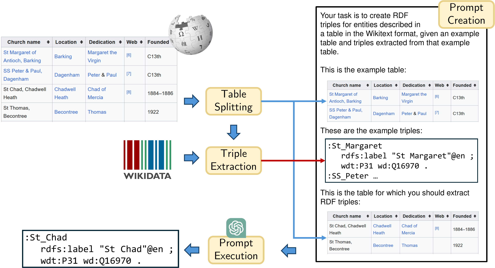

# Wikipedia-Tables-to-RDF-with-LLMs

Using few-short prompting on GPT-3.5, you can extract Wikidata RDF triples from Wikipedia tables.

## Idea

This is an overview of our approach:



## Examples

See [here](examples) for different examples.

## Installation

In order to run this PYthon3.9 project, you need to install the libraries *rdflib*, *pymediawiki*, *SPARQLWrapper* and *openai*.

### Create DBpedia/Wikidata mapping file

You first need to create the file `data/sameas-all-enwiki.tsv` as follows:

```
cd data
wget https://databus.dbpedia.org/dbpedia/wikidata/sameas-all-wikis/2022.12.01/sameas-all-wikis.ttl.bz2
bzip2 -d sameas-all-wikis.ttl.bz2
grep '<http://dbpedia.org/resource/' sameas-all-wikis.ttl > sameas-en-wiki.ttl
rm sameas-all-wikis.ttl
cd ..
python3 wikidata_dbpedia_mapper.py
rm data/sameas-all-wikis.ttl
```

### OpenAI key

You need to configure an OpenAI key in your environment variables.

## Project structure

This repository is structured as follows:
- [`data`](data): Folder containing a list of tables for experiments and the results of experiments.
   - [`data/evaluation`](data/evaluation): Results of experiments, grouped by the number of examples in the prompt and the two types of experiments. Thisa repository already contains results of two experiments:
       - Evaluation on known target triples for 1-8 examples
       - Generation of triples for unlinked entities for 5 examples
- [`examples`](examples): Folder with some example resuts and more descriptions of this repository.
- Python scripts to run experiments

## Run an Example

Run [`example.py`](example.py) to extract Wikidata triples from an example Wikipedia table and explore the created knowledge graph.

## Experiment 1: Extract new entities

Run [`experiments_new_entities.py`](experiments_new_entities.py) to extract triples for the tables defined in [`data/wikipedia_list_tables.tsv`](data/wikipedia_list_tables.tsv). As a result, one .ttl is created for table.

_The repository already contains the files created given 5 examples (`number_of_examples = 5`) [here](data/evaluation/5_examples/new_entities/outputs)._

## Experiment 2: Evaluation

Run [`experiments_existing_entities.py`](experiments_existing_entities.py) to extract triples for already linked entities in the tables defined in [`data/wikipedia_list_tables.tsv`](data/wikipedia_list_tables.tsv). As a result, one .ttl is created for table, plus JSON files iving evaluation metrics.

_The repository already contains the files created given 1-8 examples [here](data/evaluation)._
